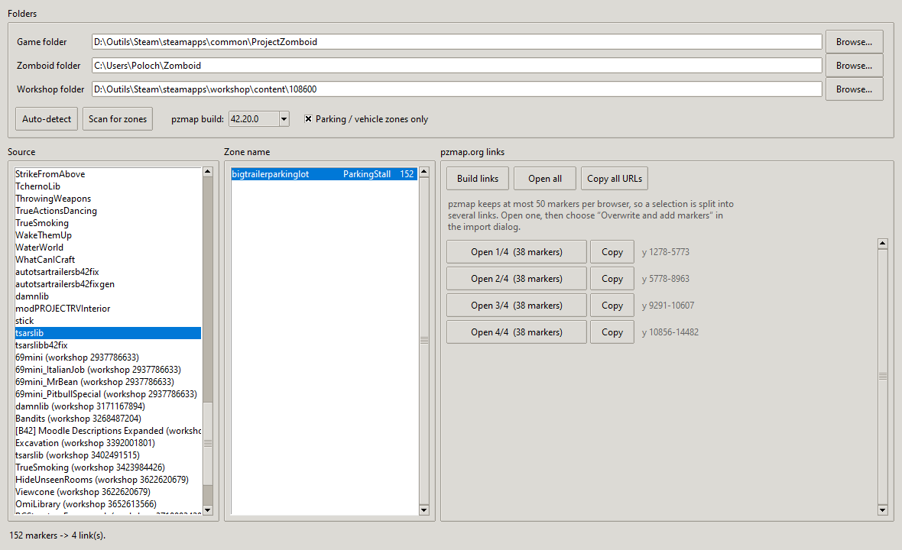

# PZ Zone Viewer

A small desktop app that turns Project Zomboid **parking-stall zones** into
[pzmap.org](https://pzmap.org) links, so you can see exactly where a mod (or the
base game) puts its vehicles.

Pick a source — a vanilla map or any installed mod — pick a zone name such as
`bigtrailerparkinglot`, and the app hands you a set of buttons. Each one opens
pzmap.org in your default browser with those zones drawn on the map, one marker
per zone.



## Why several buttons?

pzmap.org stores at most **50 personal markers per browser**, so a large
selection is split into batches of 38–48 and you get one button per batch. Open
one, choose **“Overwrite and add markers”** in pzmap's import dialog, and look
around; then move on to the next batch.

Nothing is uploaded anywhere. The markers are compressed into the URL itself
(pzmap's `PZPOI2` share format) and decoded by your browser.

## Install and run

Python 3.8 or newer, with Tkinter. No third-party packages.

```bash
python main.py
```

or

```bash
python -m pzzoneviewer
```

Tkinter ships with the python.org installers on Windows and macOS. On Linux you
may need the system package:

```bash
sudo apt install python3-tk        # Debian / Ubuntu
sudo dnf install python3-tkinter   # Fedora
sudo pacman -S tk                  # Arch
```

## Using it

1. **Folders** — the app looks for your Steam library (including
   `libraryfolders.vdf`), the game install and your `Zomboid` folder by itself.
   Fix any of them with *Browse…* if the guess is wrong, then *Scan for zones*.
2. **Source** — vanilla maps first, then every mod in `Zomboid/mods` and in the
   Steam Workshop folder, each with how many zones it defines. Most mods define
   none, so they are hidden by default; tick **Show sources with no zones** to
   list them all.
3. **Zone name** — the zone names that source defines, with how many zones each
   one has. Select several at once with Ctrl-click; each gets its own colour.
4. **Build links** — one button per batch. *Open all* opens them in sequence,
   *Copy* puts a URL on the clipboard.

Set the **pzmap build** to match the map you want to look at (`42.20.0`,
`42.19.0` or `41.78.16`).

## What it reads

Three ways of declaring a zone are recognised, which covers the base game and
the zone mods people actually ship:

| Shape | Where |
| --- | --- |
| `{ name = "...", type = "ParkingStall", x = …, y = …, width = …, height = … }` | `media/maps/<Map>/objects.lua`, `media/mapszones/<Map>/*.lua` |
| `SomeTable.addZone("name", "ParkingStall", x, y, z, w, h, "N", mod)` | zone scripts such as PZK Vanilla Plus Car Pack |
| `getWorld():registerZone(...)` / `registerVehiclesZone(...)` | mods calling the engine directly |

Commented-out lines are skipped, and small arithmetic in the coordinates
(`x = 5553+5`) is evaluated. By default only vehicle-placing types
(`ParkingStall`, `Vehicle`) are listed; untick the box to see every zone type.

The base game and mods are read the same way, from the files on disk — nothing
is bundled with the app. A vanilla map lists its own stalls (about 9 700 for
Muldraugh), and a mod lists whatever it declares, including any local edits you
have made.

Only `.lua` files that plausibly hold zones are opened — `objects.lua`, anything
under a `mapszones` or `maps` folder, and files with `zone` in the name — so
scanning a large mod list stays quick.

## Layout

```
pzzoneviewer/
  app.py        Tkinter UI
  parsers.py    Lua zone readers
  sources.py    Steam / game / mod discovery, per platform
  share.py      pzmap.org PZPOI2 share-link encoder
  config.py     settings file
main.py         entry point
```

`share.py` is a port of pzmap.org's own `buildShareBinaryV3`; its output was
checked against the site's decoder, byte for byte.

## Credits

pzmap.org is by **Cirno** and the property of hosting provided by The Indie Stone — this app only builds links for it, and does not
touch its servers beyond the page you open yourself. (Thanx to BlindCoder, Sigkill, Calvy)

Written with **Claude Opus 5** (Anthropic).

## Licence

MIT — see [LICENSE](LICENSE).
